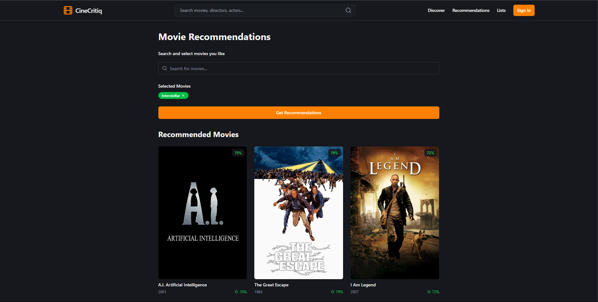

# Cine Critiq 🎬

A modern movie review and discovery platform built with React, TypeScript, and Express. Featuring an AI-powered recommendation system and comprehensive movie information.

## Features 🌟

- **Movie Discovery**: Browse trending, popular, and top-rated movies
- **Smart Recommendations**: AI-powered content-based recommendation system
- **Search Functionality**: Search for movies by title, genre, or keywords
- **Detailed Movie Information**: View comprehensive details about movies including:
  - Cast and crew information
  - User reviews and ratings
  - Similar movies
  - Movie overview and details
- **User Features**:
  - Write and manage reviews
  - Create custom movie lists
  - Maintain a watchlist
  - User authentication and profiles
- **Genre Filtering**: Filter movies by specific genres
- **Responsive Design**: Fully responsive UI that works on desktop and mobile devices
- **Modern UI**: Built with Tailwind CSS and Shadcn UI components

## Screenshots 📸

### Homepage with Trending Movies


### Movie Overview with Details


### Cast and Crew Information


### User Reviews Section


### Genre Selection


### Smart Recommendations


### Authentication


## Recent Updates 🆕

- **AI-Powered Recommendations**: Implemented a content-based recommendation system that analyzes:
  - Movie themes and tone through text analysis
  - Genre similarities
  - Language preferences
- **Enhanced Error Handling**: Added robust error handling with retries for API requests
- **Improved Movie Details**: Added comprehensive movie information including cast, crew, and similar movies
- **User Experience**: Added loading states and error messages for better UX
- **Performance Optimization**: Implemented caching and request retries
- **Type Safety**: Enhanced TypeScript types and interfaces

## Tech Stack 💻

- **Frontend**:
  - React
  - TypeScript
  - Tailwind CSS
  - Shadcn UI
  - React Query
  - Wouter (Router)

- **Backend**:
  - Express.js
  - TypeScript
  - Drizzle ORM
  - Neon Database

- **APIs**:
  - TMDB API for movie data

- **ML/AI**:
  - Custom content-based recommendation system
  - Text vectorization for movie analysis

## Getting Started 🚀

### Prerequisites

- Node.js (v18 or higher)
- npm or yarn
- Git

### Installation

1. Clone the repository:
   ```bash
   git clone https://github.com/xmanojpx/Cine-Critiq.git
   cd Cine-Critiq
   ```

2. Install dependencies:
   ```bash
   npm install
   ```

3. Create a `.env` file in the root directory and add your TMDB API key:
   ```env
   TMDB_API_KEY=your_api_key_here
   ```

4. Start the development server:
   ```bash
   npm run dev
   ```

The application will be available at `http://localhost:3000`

## Project Structure 📁

```
├── client/             # Frontend React application
│   ├── src/
│   │   ├── components/ # React components
│   │   ├── pages/     # Page components
│   │   ├── hooks/     # Custom React hooks
│   │   └── services/  # API services
├── server/            # Backend Express application
│   ├── routes/       # API routes
│   ├── ml/          # Machine learning components
│   └── services/    # Business logic
└── shared/           # Shared types and utilities
```

## Contributing 🤝

Contributions are welcome! Please feel free to submit a Pull Request.

1. Fork the project
2. Create your feature branch (`git checkout -b feature/AmazingFeature`)
3. Commit your changes (`git commit -m 'Add some AmazingFeature'`)
4. Push to the branch (`git push origin feature/AmazingFeature`)
5. Open a Pull Request

## License 📝

This project is licensed under the MIT License - see the [LICENSE](LICENSE) file for details.

## Acknowledgments 🙏

- [TMDB](https://www.themoviedb.org/) for providing the movie data API
- [Shadcn UI](https://ui.shadcn.com/) for the beautiful UI components
- [Tailwind CSS](https://tailwindcss.com/) for the utility-first CSS framework 